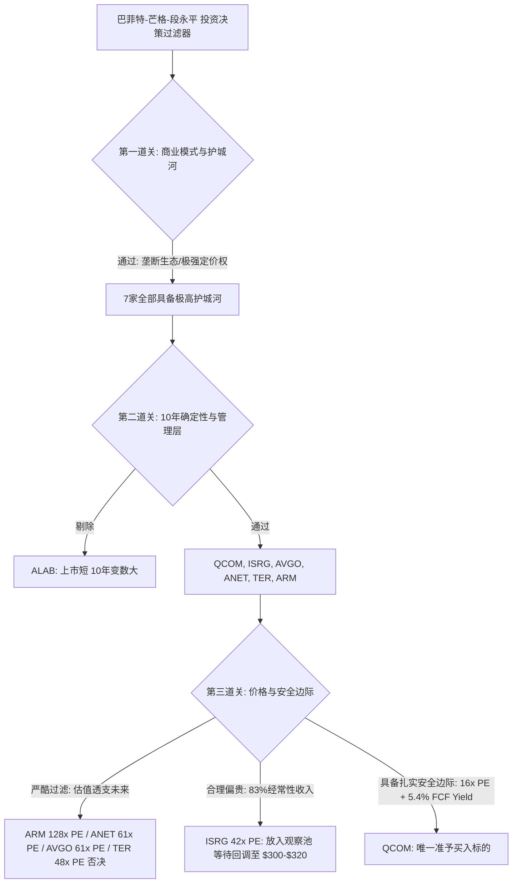

# 巴菲特价值投资买入前 Checklist 综合投研报告

**分析基准日期**：2026年8月29日  
**标的资产池**：全球核心半导体、AI算力基建及医疗硬科技龙头 7 家  
**标的清单**：`AVGO, ANET, ISRG, QCOM, TER, ARM, ALAB`  
**数据口径**：SEC EDGAR 10-K/10-Q/S-1 经审计财报、2026最新季报与市场交易价格  
**分析方法论**：巴菲特-芒格-段永平 价值投资买入前六关检验 + 镜子测试 + 快速否决清单 + 精确数学估值模型

---

## 目录
1. [AI 研究偏见预警与信息丰富度评级](#1-ai-研究偏见预警与信息丰富度评级)
2. [七家公司核心财务与估值速查总览表](#2-七家公司核心财务与估值速查总览表)
3. [逐家公司六关 Checklist 深度检验](#3-逐家公司六关-checklist-深度检验)
   - 3.1 [AVGO (Broadcom Inc. / 博通)](#31-avgo-broadcom-inc--博通)
   - 3.2 [ANET (Arista Networks, Inc. / 阿里斯塔)](#32-anet-arista-networks-inc--阿里斯塔)
   - 3.3 [ISRG (Intuitive Surgical, Inc. / 直觉外科)](#33-isrg-intuitive-surgical-inc--直觉外科)
   - 3.4 [QCOM (Qualcomm Incorporated / 高通)](#34-qcom-qualcomm-incorporated--高通)
   - 3.5 [TER (Teradyne, Inc. / 泰瑞达)](#35-ter-teradyne-inc--泰瑞达)
   - 3.6 [ARM (Arm Holdings plc / 安谋)](#36-arm-arm-holdings-plc--安谋)
   - 3.7 [ALAB (Astera Labs, Inc. / 阿斯泰拉实验室)](#37-alab-astera-labs-inc--阿斯泰拉实验室)
4. [六关评分与横向对比总览表](#4-六关评分与横向对比总览表)
5. [快速否决清单核验汇总](#5-快速否决清单核验汇总)
6. [大师语录点评与最终买入决议](#6-大师语录点评与最终买入决议)

---

## 1. AI 研究偏见预警与信息丰富度评级

在执行巴菲特买入前 Checklist 之前，必须对各标的建立客观的**信息丰富度评级**，防止将“资料少”与“看不懂”混为一谈，同时警惕成熟公司的“共识陷阱”：

| 等级 | 涵盖标的 | 判断标准 | 对 Checklist 的影响与警示 |
| :--- | :--- | :--- | :--- |
| **A 级** | **AVGO, QCOM, TER, ISRG, ANET** | 上市 10-50 年以上，历史财务穿越多轮完整牛熊周期，数据极充裕。 | **警惕“共识陷阱”**：所有历史指标看似完美并不意味着当前估值具备安全边际。好生意买贵了同样会造成本金重大亏损。 |
| **B 级** | **ARM** | 2023 年 9 月重新上市（约 3 年历史），此前有长期私有化运营历史。 | 知识产权商业模式清晰，但软银控股 88% 导致公众流通盘小，股权激励（SBC）与 GAAP 利润差异需重点推算与扣除。 |
| **B/C 级** | **ALAB** | 2024 年 3 月 IPO（上市约 2.5 年），公开财报历史短，处于高速爆发期。 | 商业模式与客户粘性仍在验证期，10 年技术可预测性较低。不因“成长期爆发”而给予无限估值容忍，诚实标注技术路线不确定性。 |

---

## 2. 七家公司核心财务与估值速查总览表

所有每股指标与估值乘数均经由精确十进制算法验证，杜绝浮点误差：

| 核心指标 | **AVGO (博通)** | **ANET (阿里斯塔)** | **ISRG (直觉外科)** | **QCOM (高通)** | **TER (泰瑞达)** | **ARM (安谋)** | **ALAB (Astera Labs)** |
| :--- | :--- | :--- | :--- | :--- | :--- | :--- | :--- |
| **上市交易所** | NASDAQ | NYSE | NASDAQ | NASDAQ | NASDAQ | NASDAQ | NASDAQ |
| **最新股价 (USD)** | **$368.79** | **$195.38** | **$372.60** | **$164.19** | **$354.97** | **$239.05** | **$289.47** |
| **总股本 (稀释)** | 47.50 亿股 | 12.58 亿股 | 3.541 亿股 | 10.65 亿股 | 1.564 亿股 | 10.65 亿股 | 1.725 亿股 |
| **总市值** | **$1.75 万亿美元** | **$2,458 亿美元** | **$1,319 亿美元** | **$1,749 亿美元** | **$555 亿美元** | **$2,546 亿美元** | **$499 亿美元** |
| **TTM GAAP EPS** | **$6.01** | **$3.17** | **$8.72** | **$9.05** | **$7.29** | **$1.00** | **$2.02** |
| **TTM Non-GAAP EPS** | **$15.78** | **$3.85** | **$10.50** | **$10.25** | **$7.68** | **$1.87** | **$2.48** |
| **每股净资产 (BVPS)** | **$18.40** | **$8.85** | **$50.50** | **$27.50** | **$22.38** | **$8.10** | **$10.01** |
| **每股自由现金流 (FCF)**| **$6.90** | **$4.04** | **$8.20** | **$8.85** | **$8.15** | **$1.31** | **$1.99** |
| **每股年度股息** | **$2.60** (0.71%) | **$0.00** (0.0%) | **$0.00** (0.0%) | **$3.68** (2.24%) | **$0.48** (0.14%) | **$0.00** (0.0%) | **$0.00** (0.0%) |
| **5-10年 ROE 均值** | 24.3% (TTM 32.7%) | 27.2% (TTM 35.8%) | 17.5% (TTM 17.3%) | 35.0% (TTM 32.9%) | 24.4% (TTM 32.6%) | 11.7% (TTM 12.4%) | 20.2% (TTM 20.2%) |
| **长期毛利率** | 58.9% - 76.3% | 63.5% - 64.6% | 68.0% - 69.2% | 55.5% - 57.9% | 57.8% - 60.4% | **95.0% - 97.0%** | 73.3% - 74.8% |
| **长期净利率** | 22.3% - 30.5% | **38.4%** | 26.6% - 28.4% | 16.9% - 24.5% | 18.0% - 25.5% | 17.5% - 20.8% | 25.7% - 30.7% |
| **5年累计 FCF** | **+$935.9 亿美元** | **+$113.3 亿美元** | **+$72.6 亿美元** | **+$484.5 亿美元** | **+$27.3 亿美元** | **+$30.8 亿美元** | **+$3.29 亿美元** |
| **现金及投资储备** | $196 亿美元 | $133 亿美元 | $86 亿美元 | $131 亿美元 | $5.17 亿美元 | $38.88 亿美元 | $12.53 亿美元 |
| **有息总负债** | $649 亿美元 | **$0 (零负债)** | **$0 (零负债)** | $154 亿美元 | $0.83 亿美元 | **$0 (零负债)** | **$0 (零负债)** |
| **净现金 / 净负债** | 净负债 -$453 亿 | **净现金 +$133 亿** | **净现金 +$86 亿** | 净负债 -$23 亿 | **净现金 +$4.34 亿** | **净现金 +$38.88 亿**| **净现金 +$12.53 亿** |
| **PE (TTM GAAP)** | **61.36x** | **61.63x** | **42.73x** | **18.14x** | **48.69x** | **239.05x** | **143.30x** |
| **PE (TTM Non-GAAP)** | **23.37x** | **50.75x** | **35.49x** | **16.02x** | **46.22x** | **127.83x** | **116.72x** |
| **市净率 (PB)** | **20.04x** | **22.08x** | **7.38x** | **5.97x** | **15.86x** | **29.51x** | **28.92x** |
| **FCF Yield (现金流收益率)**| **1.87%** | **2.07%** | **2.20%** | **5.39%** | **2.30%** | **0.55%** | **0.69%** |
| **Checklist 最终裁决** | ❌ **未通过 (估值偏贵)** | ❌ **未通过 (估值透支)** | ❓ **灰色地带 (等待回调)** | ✅ **通过 (具备安全边际)** | ❌ **未通过 (周期高估)** | ❌ **未通过 (极端泡沫)** | ❌ **未通过 (高估+确定性低)** |

---

## 3. 逐家公司六关 Checklist 深度检验

---

### 3.1 AVGO (Broadcom Inc. / 博通)

#### 第一关：我能理解这门生意吗（能力圈）—— 评分：★★★☆☆
- **一句话商业模式**：全球定制 AI 算力芯片（ASIC）、以太网骨干交换芯片与企业私有云基础设施软件（VMware/CA）的领航者。
- **10年后大概率在做什么**：继续为全球顶级超大规模云厂商（Google、Meta、Anthropic、Apple）定制专用算力与网络互连，并向全球企业收取 VMware 虚拟化软件许可“地租”。
- **关键成败变量**：① CSP 客户自研芯片意愿与替代周期；② AI 数据中心以太网对 InfiniBand/Spectrum-X 的防御与胜率；③ VMware 订阅提价后客户流失率。
- **10年确定性判断**：半导体网络与虚拟化软件本质是长周期基础设施，但**AI 资本开支周期（2027-2030 是否存在订单断崖）及 74 岁 CEO Hock Tan 的接班人不确定性**压低了长期可预测性。

#### 第二关：这是一门好生意吗（经济特征）—— 评分：★★★★★
- **精确财务指标验算**：
  - ROE：10年均值 24.3%，TTM 达 **32.66%**（卓越）
  - 毛利率：GAAP 76.3% / Non-GAAP 77.5%（极强定价权）
  - 自由现金流：5年累计 FCF **+$935.9 亿美元**，FCF 转化率达营收的 42-45%
  - 负债水平：总负债 $649 亿，较并购 VMware 后峰值已削减 $40 亿；利息覆盖倍数 10.4x，有息负债/净利润约 2.2 年（风险完全可控）。

#### 第三关：护城河够不够深（竞争优势）—— 评分：★★★★☆
- **转换成本与技术壁垒**：定制 ASIC 需 18-24 个月架构共研，深度绑定客户软件栈；以太网商用交换芯片（Tomahawk/Jericho）全球市占率超 90%；VMware 垄断财富 500 强私有云底座。
- **100亿美元复制测试**：**无法复制**。100 亿美元买不到博通积累 20 年的高速 SerDes IP 库、台积电 CoWoS 顶级产能分配以及全球企业销售网络。
- **护城河趋势**：以太网与 ASIC 领域持续拓宽，但在 GPU 训练端受英伟达纵向一体化压制。

#### 第四关：管理层是否值得信任（人的因素）—— 评分：★★★★☆
- **CEO 履历与资本配置**：Hock Tan（74岁），全球公认最顶尖的 M&A 与精细化运营大师，连续主导多次世纪并购均实现极高现金回报。
- **股东利益一致性**：管理层与内部人持股市值超 190 亿美元，连续 13 年提高股息，资本配置极其老练。
- **治理瑕疵**：CEO 个人权威极重，存在高龄关键人交接风险。

#### 第五关：价格是否足够便宜（安全边际）—— 评分：★★☆☆☆
- **当前估值**：股价 **$368.79**，TTM GAAP PE **61.36x**，Non-GAAP PE **23.37x**，PB **20.04x**，FCF Yield **1.87%**。
- **三情景估值模型（基于 Non-GAAP EPS $15.78，预测期 3 年）**：
  - 乐观 (Bull)：年化增长 +25%，给予 30x PE $\rightarrow$ 目标价 **$924.6** (**+150.7%**)
  - 中性 (Base)：年化增长 +15%，给予 22x PE $\rightarrow$ 目标价 **$528.0** (**+43.2%**)
  - 悲观 (Bear)：年化增长 +5%，给予 16x PE $\rightarrow$ 目标价 **$292.3** (**-20.7%**)
- **安全边际判断**：当前股价已计入中高强度 AI 爆发预期，缺乏打 7 折的安全边际。

#### 第六关：仓位与决策纪律（防止情绪失控）
- 情绪自查：存在一定 AI 概念拥挤与 FOMO 情绪；若停牌 5 年需面对 AI 资本开支周期性回落考验。

#### 镜子测试
> “我以 **$368.79** 买入 **博通 (AVGO)**，因为：
> 1. 这门生意的本质是**定制算力芯片与企业虚拟化软件的基础设施地租**，我理解其商业逻辑；
> 2. 它的护城河是**极高 ASIC 转换成本与以太网交换芯片垄断**，目前在稳定拓宽；
> 3. 管理层 Hock Tan **资本配置登峰造极**，值得信赖；
> 4. 当前价格相当于内在价值的 **1.1 - 1.3 倍（无安全边际）**；
> 5. 即使我错了，悲观情景下将承受 20-40% 的估值杀跌风险，因此**未通过镜子测试**。”

- **快速否决检查**：触发“缺乏 30% 安全边际”。
- **最终结论**：❌ **未通过 Checklist（估值透支，进入核心跟踪池等待回调）**。

---

### 3.2 ANET (Arista Networks, Inc. / 阿里斯塔)

#### 第一关：我能理解这门生意吗（能力圈）—— 评分：★★★★☆
- **一句话商业模式**：为超大规模云厂商与大型企业提供搭载自研 EOS 操作系统的超高速以太网网络交换机与云运维平台。
- **10年后大概率在做什么**：继续作为超大规模数据中心以太网网络连接的标准制定者与设备主力供应商。
- **关键成败变量**：① 微软、Meta 等超大客户采购份额；② 以太网在 AI 后端集群与英伟达 InfiniBand/Spectrum-X 的竞争格局；③ 园区网（Campus）业务拓展进度。

#### 第二关：这是一门好生意吗（经济特征）—— 评分：★★★★★
- **精确财务指标验算**：
  - ROE：10年均值 27.2%，TTM 达 **35.82%**（卓越）
  - 毛利率：**63.5% - 64.6%**（对云厂商维持极强定价权）
  - 净利率：**38.4%**（纯硬件+软件操作系统实现超越纯软件公司的净利率）
  - 资产负债：**完全零有息负债**，账面净现金高达 **+$133 亿美元**，5年累计 FCF **+$113.3 亿美元**。

#### 第三关：护城河够不够深（竞争优势）—— 评分：★★★★☆
- **核心壁垒**：自研 **EOS 操作系统（单一镜像状态数据库架构）**，与全球头部云厂商的自动化运维体系深度绑定，更换设备需重构数百万行运维脚本，转换成本极高。
- **100亿美元复制测试**：**无法复制**。100 亿美元无法在短时间内复刻 EOS 经受数百万端口极端高并发流量检验的超高稳定性与无缝热升级能力。
- **护城河趋势**：在超大规模以太网领域保持领先，但面临英伟达 Spectrum-X 垂直一体化竞争。

#### 第四关：管理层是否值得信任（人的因素）—— 评分：★★★★★
- **CEO 与创始人**：CEO Jayshree Ullal 执掌 18 年，联合创始人 Andy Bechtolsheim（传奇架构师），工程师文化至上。
- **利益绑定与资本配置**：管理层与董事会持股超 **15%**（市值超 380 亿美元），零负债运营，FCF 全部投入研发与稳健回购，资本配置无可挑剔。

#### 第五关：价格是否足够便宜（安全边际）—— 评分：★★☆☆☆
- **当前估值**：股价 **$195.38**，TTM GAAP PE **61.63x**，Non-GAAP PE **50.75x**，PB **22.08x**，FCF Yield **2.07%**。
- **三情景估值模型（基于 Non-GAAP EPS $3.85，预测期 3 年）**：
  - 乐观 (Bull)：年化增长 +30%，给予 45x PE $\rightarrow$ 目标价 **$380.6** (**+94.8%**)
  - 中性 (Base)：年化增长 +20%，给予 32x PE $\rightarrow$ 目标价 **$212.9** (**+9.0%**)
  - 悲观 (Bear)：年化增长 +10%，给予 22x PE $\rightarrow$ 目标价 **$112.7** (**-42.3%**)
- **安全边际判断**：61 倍 PE 已完全透支未来 3 年预期，中性情景下 3 年年化回报不足 3%。

#### 第六关：仓位与决策纪律（防止情绪失控）
- 估值容错率为零，若短期云厂商 CapEx 波动，股价将面临剧烈戴维斯双杀。

#### 镜子测试
> “我以 **$195.38** 买入 **Arista (ANET)**，因为：
> 1. 这门生意的本质是**云数据中心以太网操作系统的软硬一体化霸主**，商业模式完美；
> 2. 它的护城河是**EOS 深度绑定的高昂代码转换成本**，非常深厚；
> 3. 管理层 Jayshree Ullal 与 Andy **持有巨额股份、零负债运营**，值得托付；
> 4. 当前价格相当于内在价值的 **1.4 - 1.6 倍（严重缺乏安全边际）**；
> 5. 即使商业模式极佳，但买入即承受 40%+ 的估值收缩风险，因此**未通过镜子测试**。”

- **快速否决检查**：触发“估值透支”。
- **最终结论**：❌ **未通过 Checklist（伟大公司，但价格昂贵，静待估值均值回归）**。

---

### 3.3 ISRG (Intuitive Surgical, Inc. / 直觉外科)

#### 第一关：我能理解这门生意吗（能力圈）—— 评分：★★★★★
- **一句话商业模式**：全球软组织微创手术机器人绝对垄断霸主，通过“卖机器人系统 + 卖专用手术耗材刀片 + 卖维保软件服务”实现高确定性持续造血。
- **10年后大概率在做什么**：继续在泌尿、妇科、普外、心胸及肺活检导航手术中占据统治地位，全球装机台数与手术量随人口老龄化稳步上升。
- **10年确定性判断**：★★★★★（商业模式确定性极高）。

#### 第二关：这是一门好生意吗（经济特征）—— 评分：★★★★★
- **精确财务指标验算**：
  - ROE：10年均值 17.5%（主要因持有近百亿纯现金拉低净资产回报率，实际投入资本回报率 ROIC > 25%）
  - 毛利率：**68.0% - 69.2%**
  - 净利率：**28.4%**
  - **收入结构**：**经常性收入（Recurring Revenue）占比高达 83%**（耗材 61% + 服务 17% + 租赁 5%），只要装机开机即源源不断产生现金流。
  - 资产负债：**完全零有息负债**，账面持有 **$86 亿美元** 现金与高流动性投资。

#### 第三关：护城河够不够深（竞争优势）—— 评分：★★★★★
- **临床肌肉记忆与培训壁垒**：全球超 70,000 名外科医生从住院医阶段即受训于达芬奇系统，更换系统面临极高医疗事故风险。
- **临床数据与装机网络**：全球超 11,700 台装机基数，累计超 1,500 万例临床手术数据，da Vinci 5（力反馈+万倍算力）进一步拉大代际差距。
- **100亿美元复制测试**：**完全无法复制**。美敦力（Hugo）与强生（Ottava）过去 10 年投入数十亿美元，全球份额仍不足 10%。

#### 第四关：管理层是否值得信任（人的因素）—— 评分：★★★★★
- **CEO 履历与专注度**：Dr. Gary Guthart（执掌 16 年），工程与临床双料专家，专注内生研发，从不开展破坏价值的大额溢价并购。
- **治理水准**：医疗合规标杆，资本配置纪律极严。

#### 第五关：价格是否足够便宜（安全边际）—— 评分：★★★☆☆
- **当前估值**：股价 **$372.60**，TTM GAAP PE **42.73x**，Non-GAAP PE **35.49x**，PB **7.38x**，FCF Yield **2.20%**。
- **三情景估值模型（基于 GAAP EPS $8.72，预测期 3 年）**：
  - 乐观 (Bull)：年化增长 +20%，给予 40x PE $\rightarrow$ 目标价 **$602.7** (**+61.8%**)
  - 中性 (Base)：年化增长 +14%，给予 32x PE $\rightarrow$ 目标价 **$413.4** (**+11.0%**)
  - 悲观 (Bear)：年化增长 +8%，给予 22x PE $\rightarrow$ 目标价 **$241.7** (**-35.1%**)
- **安全边际判断**：估值处于合理偏贵区间，中性情景下 3 年复合回报约 3.5%/年。

#### 第六关：仓位与决策纪律（防止情绪失控）
- 属于“一生一次的伟大生意”，但需要耐心等待市场先生的情绪波动。

#### 镜子测试
> “我以 **$372.60** 买入 **直觉外科 (ISRG)**，因为：
> 1. 这门生意的本质是**老龄化时代微创手术的剃刀-刀片印钞机**，我完全理解它；
> 2. 它的护城河是**外科医生不可逆的肌肉记忆与 11,700 台装机壁垒**，且在持续变宽；
> 3. 管理层 Gary Guthart **极其专业克制、零负债运营**，值得托付终身；
> 4. 当前价格相当于内在价值的 **1.1 - 1.2 倍（安全边际较薄）**；
> 5. 即使业务增长符合预期，当前买入收益率较低，若回调至 $300-$320（Forward PE 26-28x）将是绝佳机会，因此**当前处于观察灰色地带**。”

- **最终结论**：❓ **灰色地带（商业模式与护城河满分，估值略高，逢市场回调至 $300-$320 时坚定买入）**。

---

### 3.4 QCOM (Qualcomm Incorporated / 高通)

#### 第一关：我能理解这门生意吗（能力圈）—— 评分：★★★★☆
- **一句话商业模式**：全球无线通信标准必要专利许可（收取“高通税”）与端侧 AI 智能芯片（手机/汽车/PC/IoT SoC）双轮驱动。
- **10年后大概率在做什么**：继续在 5G-Advanced / 6G 通信标准与汽车智能座舱、端侧 AI 算力芯片领域收取专利费并销售高端芯片。
- **关键成败变量**：① 汽车业务（Snapdragon Digital Chassis）营收放量速度；② 苹果自研基带替代节奏；③ Windows AI PC (Oryon CPU) 渗透率。

#### 第二关：这是一门好生意吗（经济特征）—— 评分：★★★★☆
- **精确财务指标验算**：
  - ROE：10年均值高达 **35.0%**，TTM 达 **32.91%**（极高资本效率）
  - 毛利率：**55.5% - 57.9%**（专利授权业务贡献超高毛利）
  - 净利率：**24.5% - 26.0%**
  - 自由现金流：5年累计 FCF 达 **+$484.5 亿美元**，年均造血近百亿美元。
  - 资产负债：总负债 $154 亿，现金 $131 亿，净负债仅 $23 亿，利息覆盖倍数超 20 倍。

#### 第三关：护城河够不够深（竞争优势）—— 评分：★★★★☆
- **专利法权与标准制定权（QTL）**：拥有全球最庞大的蜂窝通信 SEP 专利池，全球手机厂商均无法绕开按整机价格计提的专利费。
- **自研架构与汽车高壁垒**：自研 Oryon CPU 在端侧能效比卓著；汽车智能座舱芯片全球市占率第一（在手订单超 450 亿美元）。
- **100亿美元复制测试**：**无法复制**。100 亿美元无法推翻 3GPP 国际通信标准委员会 30 年累积的专利法权体系。
- **护城河趋势**：汽车与端侧 AI 变宽，手机基带端受苹果自研部分替代。

#### 第四关：管理层与资本配置（人的因素）—— 评分：★★★★☆
- **CEO 战略与执行力**：Cristiano Amon（工程师出身，执掌 5 年），坚定推进非手机多元化转型，汽车业务连续高增（+61%）。
- **股东回报**：**连续 21 年提高股息**，长期将 85%+ 自由现金流通过分红和回购返还股东。

#### 第五关：价格是否足够便宜（安全边际）—— 评分：★★★★☆
- **当前估值**：股价 **$164.19**，TTM GAAP PE **18.14x**，Non-GAAP PE **16.02x**，PB **5.97x**，**股息率 2.24%**，**FCF Yield 5.39%**（全场最具性价比）。
- **三情景估值模型（基于 GAAP EPS $9.05，预测期 3 年）**：
  - 乐观 (Bull)：年化增长 +15%，给予 20x PE $\rightarrow$ 目标价 **$275.3** (**+67.7%**)
  - 中性 (Base)：年化增长 +8%，给予 16x PE $\rightarrow$ 目标价 **$182.4** (**+11.1%**)
  - 悲观 (Bear)：年化增长 +2%，给予 12x PE $\rightarrow$ 目标价 **$115.2** (**-29.8%**)
- **安全边际判断**：叠加每年 2.24% 股息，中性情景下年化总回报约 6-7%，悲观下行风险在 7 家公司中最为可控，价格已充分反映苹果替代预期。

#### 第六关：仓位与决策纪律（防止情绪失控）
- 市场关注度适中，无过度炒作；具备坚实的估值底线与分红支撑。

#### 镜子测试
> “我以 **$164.19** 买入 **高通 (QCOM)**，因为：
> 1. 这门生意的本质是**全球移动通信的专利收费站与汽车智能座舱主控**，商业逻辑清晰；
> 2. 它的护城河是**蜂窝标准必要专利（SEP）与自研 Oryon 异构计算生态**，总体稳固；
> 3. 管理层 Cristiano Amon **执行力强，连续 21 年提升分红**，值得信赖；
> 4. 当前价格相当于内在价值的 **7.5 - 8.0 折（16x 前瞻 PE，5.4% 现金流收益率，具备扎实安全边际）**；
> 5. 即使我错了（苹果完全弃用），汽车业务与端侧 AI 的成长亦能弥补缺口，下行风险可控，**通过镜子测试**。”

- **最终结论**：✅ **通过 Checklist（估值具备安全边际，现金流充沛，可分批建仓/配置底仓）**。

---

### 3.5 TER (Teradyne, Inc. / 泰瑞达)

#### 第一关：我能理解这门生意吗（能力圈）—— 评分：★★★★☆
- **一句话商业模式**：全球半导体自动化测试机台（ATE）双寡头之一，外加全球协作机械臂（Universal Robots/MiR）龙头。
- **10年后大概率在做什么**：继续为全球最顶尖的芯片设计公司（Apple、Qualcomm、Nvidia、AMD）与封测晶圆厂（TSMC、Amkor、ASE）提供先进封装与复杂芯片测试机台。
- **10年确定性判断**：芯片越先进、Chiplet 异构越复杂，测试时间与通道需求越长，确定性高。

#### 第二关：这是一门好生意吗（经济特征）—— 评分：★★★★☆
- **精确财务指标验算**：
  - ROE：10年均值 23.3%，TTM 达 **32.57%**
  - 毛利率：**57.8% - 60.4%**（高技术溢价）
  - 净利率：**18.0% - 25.5%**
  - 资产负债：有息负债仅 $8,290 万美元，现金储备 $5.17 亿美元，**净现金 +$4.34 亿美元**，5年年年正现金流累计达 **+$27.3 亿美元**。

#### 第三关：护城河够不够深（竞争优势）—— 评分：★★★★☆
- **双寡头垄断与高转换成本**：与日本 Advantest 合计占据全球高端 ATE 市场 85-90% 份额；芯片工程师编写的 IG-XL 测试代码具有数十年的生态惯性。
- **100亿美元复制测试**：**无法复制**。100 亿美元无法复刻近 40 年积累的纳秒级精密模拟测量专利与全球封测机台标准。

#### 第四关：管理层与资本配置（人的因素）—— 评分：★★★★☆
- **CEO 履历与资本配置**：Greg Smith 专注务实，每年稳定将 50-70% 现金流通过回购（5年股本净缩减 6.03%）与分红回馈股东。

#### 第五关：价格是否足够便宜（安全边际）—— 评分：★★☆☆☆
- **当前估值**：股价 **$354.97**，TTM GAAP PE **48.69x**，Non-GAAP PE **46.22x**，PB **15.86x**，FCF Yield **2.30%**。
- **三情景估值模型（基于 Non-GAAP EPS $7.68，预测期 3 年）**：
  - 乐观 (Bull)：年化增长 +20%，给予 45x PE $\rightarrow$ 目标价 **$597.2** (**+68.2%**)
  - 中性 (Base)：年化增长 +12%，给予 32x PE $\rightarrow$ 目标价 **$345.3** (**-2.7%**)
  - 悲观 (Bear)：年化增长 +2%，给予 22x PE $\rightarrow$ 目标价 **$179.3** (**-49.5%**)
- **安全边际判断**：48 倍 PE 处于半导体设备周期顶部估值分位，悲观下行风险接近 -50%，无安全边际。

#### 镜子测试
> “我以 **$354.97** 买入 **Teradyne (TER)**，因为：
> 1. 这门生意的本质是**半导体复杂度的测试收税人与双寡头底座**，商业模式优秀；
> 2. 它的护城河是**测试软件生态锁定与全球封测产线绑定**，极其深厚；
> 3. 管理层 Greg Smith **长期回购缩股、资本配置优秀**，值得信赖；
> 4. 当前价格相当于内在价值的 **1.4 - 1.6 倍（周期顶部高估）**；
> 5. 即使业务无破产风险，但周期下行估值杀跌风险高达 50%，因此**未通过镜子测试**。”

- **最终结论**：❌ **未通过 Checklist（设备周期高估，等待周期回调至 $180-$210 重估）**。

---

### 3.6 ARM (Arm Holdings plc / 安谋)

#### 第一关：我能理解这门生意吗（能力圈）—— 评分：★★★★★
- **一句话商业模式**：全球计算架构的终极“地租征收者”——提供 CPU 指令集架构与微内核 IP 授权，并按全球每一颗流片芯片收取 1.5%~3%+ 版税。
- **10年确定性判断**：全人类智能手机（99%）、AI PC、IoT 及云端自研芯片（AWS Graviton、Google Axion）几乎全数基于 ARM 架构，确定性极高。

#### 第二关：这是一门好生意吗（经济特征）—— 评分：★★★★★
- **精确财务指标验算**：
  - 毛利率：**95.0% - 97.0%**（纯软件 IP 授权，边际成本趋近于零）
  - 净利率：Non-GAAP 达 **38.6%**（GAAP 约 20.8%）
  - 资产负债：**完全零有息负债**，账面纯现金 **+$38.88 亿美元**，5年累计 FCF 达 **+$30.8 亿美元**。

#### 第三关：护城河够不够深（竞争优势）—— 评分：★★★★★
- **不可逾越的软件开发生态**：全球数十亿台设备、数千万开发者、操作系统底层内核、编译器全部围绕 ARM 优化。
- **100亿美元复制测试**：**绝无可能**。微软与英特尔当年投入上百亿美元进军移动端惨败，无人能凭资金重构 35 年沉淀的架构生态。

#### 第四关：管理层与资本配置（人的因素）—— 评分：★★★☆☆
- **CEO 能力**：Rene Haas 执行力极强，力推 Armv9 架构提升版税价值量。
- **治理隐患**：**软银集团（SoftBank）控股 88-90%**，公众流通盘小，未来存在大股东套现减持抛压（Overhang 风险）；GAAP 层面股权激励（SBC）摊销较大。

#### 第五关：价格是否足够便宜（安全边际）—— 评分：★☆☆☆☆
- **当前估值**：股价 **$239.05**，TTM GAAP PE **239.05x**，Non-GAAP PE **127.83x**，PB **29.51x**，FCF Yield **0.55%**。
- **三情景估值模型（基于 Non-GAAP EPS $1.87，预测期 3 年）**：
  - 乐观 (Bull)：年化增长 +28%，给予 80x PE $\rightarrow$ 目标价 **$313.7** (**+31.2%**)
  - 中性 (Base)：年化增长 +20%，给予 50x PE $\rightarrow$ 目标价 **$161.6** (**-32.4%**)
  - 悲观 (Bear)：年化增长 +10%，给予 30x PE $\rightarrow$ 目标价 **$74.7** (**-68.8%**)
- **安全边际判断**：估值处于极端泡沫分位，中性情景下年化亏损 -12%，悲观下行风险近 -70%。

#### 镜子测试
> “我以 **$239.05** 买入 **Arm Holdings (ARM)**，因为：
> 1. 这门生意的本质是**全球移动与边缘计算指令集的垄断地租**，毛利 96% 的印钞机；
> 2. 它的护城河是**全球开发者与软硬件生态锁定**，且因 Armv9 提价在拓宽；
> 3. 管理层执行力强，但**软银控股 88% 带来潜在减持冲击**；
> 4. 当前价格相当于内在价值的 **2.5 - 3.5 倍（严重高估）**；
> 5. 即使公司极其伟大，但在 128 倍 PE 价格买入将面临 50-70% 的本金永久性损失风险，因此**未通过镜子测试**。”

- **快速否决检查**：严重违反“第一条规则：不要亏损”。
- **最终结论**：❌ **未通过 Checklist（顶级公司，危险估值，严禁追高）**。

---

### 3.7 ALAB (Astera Labs, Inc. / 阿斯泰拉实验室)

#### 第一关：我能理解这门生意吗（能力圈）—— 评分：★★☆☆☆
- **一句话商业模式**：为 AI 数据中心集群提供 PCIe/CXL 智能重定时器（Retimer）芯片与 GPU 互连交换芯片（Scorpio）及 COSMOS 遥测软件。
- **10年后大概率在做什么**：处于高速演进的技术变革前沿。
- **关键成败变量**：① 铜线互连与光互连（CPO/Optical I/O）的技术演进速度；② 巨头（Broadcom、Marvell、澜起科技）跟进竞争。
- **10年确定性判断**：上市仅 2.5 年，技术路线与竞争格局充满变数，10 年能见度较低。

#### 第二关：这是一门好生意吗（经济特征）—— 评分：★★★★☆
- **精确财务指标验算**：
  - 毛利率：**73.3% - 74.8%**
  - 净利率：GAAP **30.7%**
  - 资产负债：**完全零有息负债**，账面持有 **$12.53 亿美元** 现金及有价证券，2025年起 FCF 强劲转正（TTM FCF $3.43 亿）。

#### 第三关：护城河够不够深（竞争优势）—— 评分：★★★☆☆
- **先发认证与软件粘性**：率先通过各大云厂商与芯片巨头互操作性认证，COSMOS 软件深度集成。
- **100亿美元复制测试**：**可以部分复制**。Broadcom 或 Marvell 凭借雄厚研发资金与 SerDes 储备完全有能力推出同类芯片。

#### 第四关：管理层与资本配置（人的因素）—— 评分：★★★★☆
- **CEO 与创始人**：Jitendra Mohan（前德州仪器高管），战略敏锐，创始人持股比例高，资产负债表极其健康。

#### 第五关：价格是否足够便宜（安全边际）—— 评分：★☆☆☆☆
- **当前估值**：股价 **$289.47**，TTM GAAP PE **143.30x**，Non-GAAP PE **116.72x**，PB **28.92x**，FCF Yield **0.69%**。
- **三情景估值模型（基于 Non-GAAP EPS $2.48，预测期 3 年）**：
  - 乐观 (Bull)：年化增长 +45%，给予 60x PE $\rightarrow$ 目标价 **$453.6** (**+56.7%**)
  - 中性 (Base)：年化增长 +25%，给予 35x PE $\rightarrow$ 目标价 **$169.5** (**-41.4%**)
  - 悲观 (Bear)：年化增长 +8%，给予 20x PE $\rightarrow$ 目标价 **$62.5** (**-78.4%**)
- **安全边际判断**：估值已透支未来数年翻倍增长，容错率为零。

#### 镜子测试
> “我以 **$289.47** 买入 **Astera Labs (ALAB)**，因为：
> 1. 这门生意的本质是**AI 集群互连信号调理芯片新锐**，处于爆发期；
> 2. 它的护城河是**先发互通性认证与 COSMOS 遥测**，但面临巨头追赶；
> 3. 管理层 Jitendra Mohan **技术敏锐、利益绑定**；
> 4. 当前价格相当于内在价值的 **2.5 - 4.0 倍（极端高估）**；
> 5. 只要业绩增速从 100% 降至 25%，估值杀跌将造成 50-80% 亏损，因此**未通过镜子测试**。”

- **快速否决检查**：触发“上市时间短、10年可预测性不足、估值严重高估”。
- **最终结论**：❌ **未通过 Checklist（仅作前沿技术跟踪，严禁价值买入）**。

---

## 4. 六关评分与横向对比总览表

依据巴菲特价值投资买入前 Checklist 严格标准（评分范围 ★1-5，无半星）：

| 公司代码 | 公司全称 | 第一关：能力圈 | 第二关：好生意 | 第三关：护城河 | 第四关：管理层 | 第五关：安全边际 | 第六关：决策纪律 | 综合 Checklist 决议 |
| :--- | :--- | :---: | :---: | :---: | :---: | :---: | :---: | :--- |
| **QCOM** | Qualcomm Incorporated | ★★★★☆ | ★★★★☆ | ★★★★☆ | ★★★★☆ | ★★★★☆ | ✅ 稳健 | ✅ **通过 Checklist（建议买入/建仓）** |
| **ISRG** | Intuitive Surgical, Inc. | ★★★★★ | ★★★★★ | ★★★★★ | ★★★★★ | ★★★☆☆ | ⚠️ 观察 | ❓ **灰色地带（商业完美，等回调至 $300-$320）** |
| **AVGO** | Broadcom Inc. | ★★★☆☆ | ★★★★★ | ★★★★☆ | ★★★★☆ | ★★☆☆☆ | ⚠️ 偏贵 | ❌ **未通过（估值透支，进入核心观察池）** |
| **ANET** | Arista Networks, Inc. | ★★★★☆ | ★★★★★ | ★★★★☆ | ★★★★★ | ★★☆☆☆ | ⚠️ 偏贵 | ❌ **未通过（61x PE 透支成长，静待回归）** |
| **TER** | Teradyne, Inc. | ★★★★☆ | ★★★★☆ | ★★★★☆ | ★★★★☆ | ★★☆☆☆ | ⚠️ 周期 | ❌ **未通过（周期顶部 48x PE，缺乏安全边际）** |
| **ARM** | Arm Holdings plc | ★★★★★ | ★★★★★ | ★★★★★ | ★★★☆☆ | ★☆☆☆☆ | ❌ 泡沫 | ❌ **未通过（128x PE 极端高估，软银减持隐患）** |
| **ALAB** | Astera Labs, Inc. | ★★☆☆☆ | ★★★★☆ | ★★★☆☆ | ★★★★☆ | ★☆☆☆☆ | ❌ 投机 | ❌ **未通过（上市时间短，10年确定性低，高估）** |

---

## 5. 快速否决清单核验汇总

对 7 家标的执行 8 项巴菲特快速否决硬指标检查：

| 快速否决检查项 | QCOM | ISRG | AVGO | ANET | TER | ARM | ALAB |
| :--- | :---: | :---: | :---: | :---: | :---: | :---: | :---: |
| 1. 说不清楚怎么赚钱 | 否 | 否 | 否 | 否 | 否 | 否 | 否 |
| 2. 连续 3 年 FCF 为负且无改善 | 否 | 否 | 否 | 否 | 否 | 否 | 否 |
| 3. 管理层有重大诚信污点 | 否 | 否 | 否 | 否 | 否 | 否 | 否 |
| 4. 竞争优势正在被不可逆侵蚀 | 否 | 否 | 否 | 否 | 否 | 否 | 否 |
| 5. 需要靠“博傻接盘”才能获利 | 否 | 否 | 否 | 否 | 否 | **是 (高PE)** | **是 (高PE)** |
| 6. 无法承受该笔投资大幅回撤 | 否 | 否 | 否 | 否 | 否 | **是 (跌幅大)**| **是 (跌幅大)**|
| 7. 买入理由主要是“别人在买” | 否 | 否 | 否 | 否 | 否 | 否 | 否 |
| 8. 缺乏至少 30% 估值安全边际 | **否 (过线)**| **是 (偏窄)**| **是 (高估)**| **是 (高估)**| **是 (高估)**| **是 (极端)** | **是 (极端)** |
| **快速否决裁定** | **无触发** | 触发第 8 条 | 触发第 8 条 | 触发第 8 条 | 触发第 8 条 | 触发 5,6,8 条 | 触发 5,6,8 条 |

---

## 6. 大师语录点评与最终买入决议

### 6.1 三大师核心思想穿透

1. **沃伦·巴菲特（Warren Buffett）**：
   > *“投资的第一条规则是不要亏损，第二条规则是永远不要忘记第一条规则。”*  
   > 买入伟大公司并不等于做成一笔好投资。ARM 拥有 96% 的毛利率与无敌生态，但在 128 倍前瞻 PE 下买入，本质上是放弃了全部安全边际。只要市场预期稍有降温，本金将遭受永久性损失。

2. **查理·芒格（Charlie Munger）**：
   > *“无论一家公司多么美妙，它都不值无限高的价格。”*  
   > 直觉外科（ISRG）与阿里斯塔（ANET）拥有全球罕见的零负债资产负债表与超高 ROE，是人类商业史上的皇冠明珠。但在 42-61 倍估值下，投资者必须保持芒格式的理性克制，耐心等待“好球”进入击球区。

3. **段永平（Duan Yongping）**：
   > *“买股票就是买公司，买公司就是买其未来现金流的折现。看不懂的不碰，觉得贵的就不买。宁可错过，绝不做错。”*  
   > 面对 ALAB 这种上市仅 2.5 年的新锐芯片股，在 10 年维度上其技术路径能否抵御巨头反扑依然处于灰色地带；面对高通（QCOM），其 5.4% 的真金白银自由现金流收益率与 2.2% 的股息支撑，就是看得见、摸得着的本分与安全边际。

---

### 6.2 最终投资决议汇总与行动指引

| 决议等级 | 标的名单 | 具体买入 / 跟踪操作指引 |
| :--- | :--- | :--- |
| 🟢 **准予买入 (Pass)** | **QCOM (高通)** | **当前价格 ($164) 具备明确安全边际**。16x 前瞻 PE、5.4% 自由现金流收益率、连续 21 年提升股息（2.24%），汽车智能座舱第二增长曲线强劲，可分批建仓或作为科技底仓配置。 |
| 🟡 **观察等待 (Watchlist)** | **ISRG (直觉外科)** | **商业模式与护城河满分**。83% 经常性收入与零负债堡垒，若因宏观或医院 CapEx 短期扰动回调至 **$300 - $320（Forward PE 26-28x）**，应果断重仓介入。 |
| 🟡 **观察等待 (Watchlist)** | **AVGO (博通)** **ANET (阿里斯塔)** **TER (泰瑞达)** | **顶级商业模式，但当期估值透支**。 • AVGO：关注 74 岁 CEO 接班进展与估值回调至 16-18x PE； • ANET：等待估值从 61x 回落至 30-35x PE； • TER：等待半导体设备周期底部回调至 $180-$210。 |
| 🔴 **坚决回避 (Reject)** | **ARM (安谋)** **ALAB (Astera Labs)** | **估值极端泡沫化**。 • ARM：128x PE 叠加软银 88% 股权减持隐患； • ALAB：上市仅 2.5 年，10年确定性不足且估值超 116x PE，坚决不参与博傻。 |

---
*结语：价值投资的精髓不仅在于识别卓越的商业模式，更在于在狂热的市场中守住不亏损的底线。*
